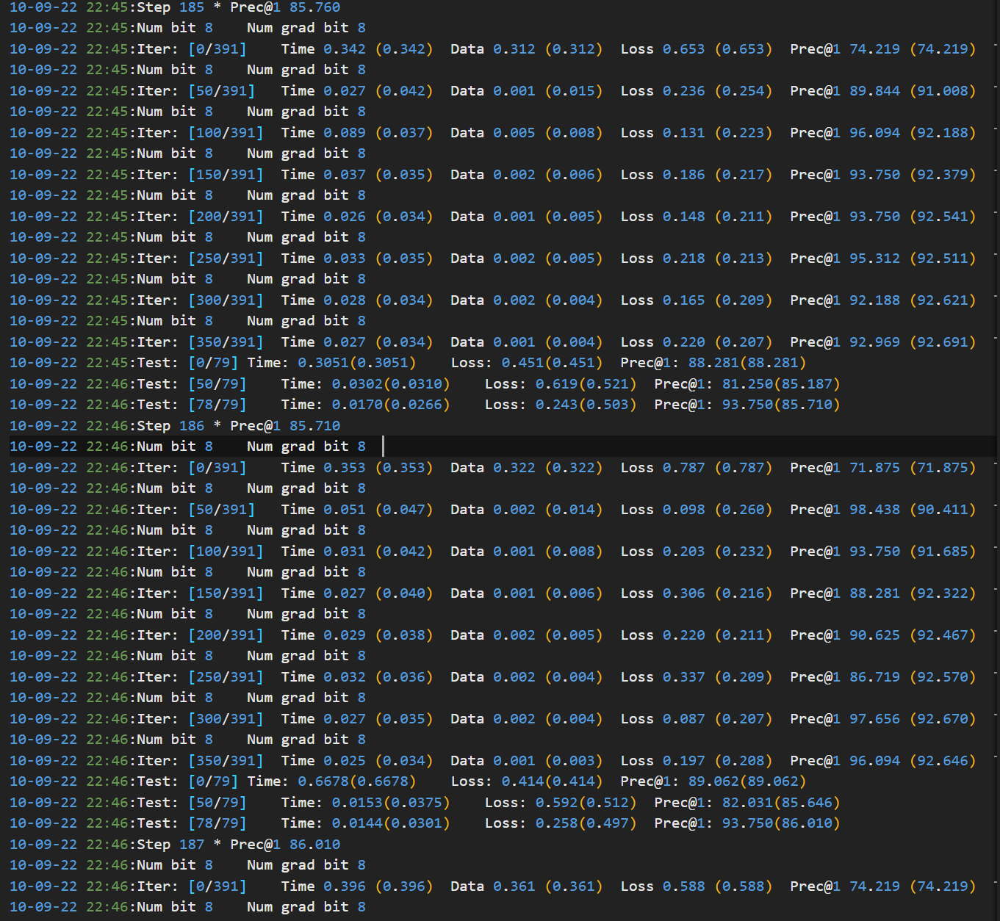

# Experiments setting in Trip 
---

## TODO List 

- [x] 实现 trip 计算的基本模块
- [x] 浮点计算过程的实现 （作为baseline）

## 实验分析 

目前基本实现了trip 相应的计算模块，但是总体的精度还是无法达到要求，有如下几个问题需要解决： 

### 反向传播的梯度
反向传播的梯度实际上在不断变化，使用同样的量化方法，得到的结果是不准确的，考虑是否在每个 epoch 之前都 设定一个测量的标准？ （重新进行measurement） 

整体上而言，qinput 没有太大的变化，但是在训练过程中，qoutput 的梯度变化应该是很大的，在这种情况下，实际上就会遇到这样的问题，即scaling 的设置导致了最终梯度受到了很大的影响，因此要考虑去调整对应的scaling。 

### 权重梯度最终更新到权重上的影响

通过上面的更新可以看出，因为在每个epoch 设置了权重的更新，在这种情况下，可以看到，在每个开始训练的样本中，loss 是比较大的，实际上造成这样问题的原因，可以理解为是，更新前的权重和更新后的权重计算是不相符合的，是否还是考虑之前的方案，也就是仅仅在影响到权重时才更新？ 但似乎这样仍然有所问题， 考虑一下上述问题？ 

### momentum 
上述两个问题重点影响了精度，但是剩余的问题，同样也会影响到最终的结果。 主要是momentum 和 weight decay。 momentum 是在权重更新的时候，将原始的权重梯度 乘上了一个基本的系数，然后再进行更新 （似乎这个是可以实现的？ 通过在原始位置保留上一个基本的值，然后再更新？） 

### weight decay 
是需要加上一个正则项作为loss，实际上就是在过程中，对于权重进行一部分的限制，在梯度上，每次都更新了权重的大小的 weight decay